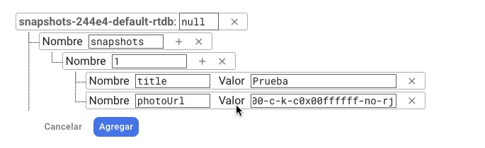

# Firebase

Firebase es una base de datos no relacional en la nube que nos proporciona google

## Crear un proyecto Firebase
Para comenzar a implementar Firebase se hace lo siguiente:
1. Se crea un proyecto:\
   
2. Se nombra el proyecto con un nombre valido:\
   
3. Se selecciona la region para google Analytics\
   
4. Finalmente se ha creado el proyecto y se tiene la consola de Firabase en la que se muestran todos nuestros proyectos:\
   

## Crear base de datos y tablas en Firebase

Para crear tablas en Firebase se hace lo siguiente:
1. En la seccion de Realtime Database se selecciona crear nueva base de datos:\
   \
2. Se selecciona la ubicacion en la que estar la base de datos:\
   \
3. Se seleciona el modo en el que estar, el modo de prueba dura 30 dias:\
   \
4. para crear una tabla se oprime el +:\
   \
5. Para crear un registro se coloca el valor de id o key del registro y sus propiedades junto con sus valores:\
   \

## Integrar un proyecto de Firebase a Android
Para comenzar a integrar un un proyecto ya creado de Firebase a tu proyecto android se hace lo siguiente:
1. Se debe conectar con nuestra cuenta de firebase, en la esquina superior derecha de la ventana:\
   
2. Se le da next hasta llegar a esta parte donde se selecciona acceder con Firebase:\
   
3. Se da en comenzar y se selecciona el proyecto que creamos\
   
4. Ya que estamos conectados, en la pestana de Tools, se busca Firebase\
   
5. Se selecciona Cloud Storage for Firebase con Kotlin para implementar ahora si Firebase en nuestro proyecto:\
   
6. Se siguen los pasos que marca esa documentacion, empezando por agregar las dependencias a Gradle:\
   \
   En el build.gradle(Project:...)
   ```java
   plugins {
      ...
      id 'com.google.gms.google-services' version '4.3.10' apply false
   }
   ```
   En el build.gradle(Module):
   ```java
   plugins {
      ...
      id 'com.google.gms.google-services'
   }
   ...
   dependencies {
      ...
      // Import the BoM for the Firebase platform
      implementation platform('com.google.firebase:firebase-bom:31.2.0')
      // Declare the dependency for the Cloud Storage library
      // When using the BoM, you don't specify versions in Firebase library dependencies
      implementation 'com.google.firebase:firebase-storage-ktx'
   }
   ```

## Integrar Firebase UI y Auth

Firebase UI nos facilita la implementacion de autenticacion\
La documentacion oficial de FirebaseUi esta en: https://firebase.google.com/docs/auth/android/firebaseui?hl=es-419\
Desde aqui podemos ir directamente al github de esta libreria: https://github.com/firebase/firebaseui-android

Se comienza implementando las librerias de database y auth en el build.gradle(Module):
```java
dependencies {
   ...
    // FirebaseUI for Firebase Realtime Database
    implementation 'com.firebaseui:firebase-ui-database:8.0.2'

    // FirebaseUI for Firebase Auth
    implementation 'com.firebaseui:firebase-ui-auth:8.0.2'
}
```

## DataClass para Firebase

Se debe comenzar por crear las clases que se estaran utilizando,\
lo que seran basicamente nuestras tablas en Firebase\
Se debe colocar la etiqueta @IgnoreExtraPropoerties de acuerdo a la documentacion de Firebase
```kotlin
@IgnoreExtraProperties
data class Snapshot(@get:Exclude var id: String = "",
                    var ownerUid: String = "",
                    var title: String = "",
                    var photoUrl: String ="",
                    var likeList: Map<String, Boolean> = mutableMapOf())
```

## Adaptador ViewHolder con Firebase

Se tiene dos formas para crear adaptadores, como se vio en la seccion 9 o esta que nos proporciona firebase,\
ambas tienen sus ventajas, pero funciona con ambas

Todo lo siguiente se implementa en nuestra activity o en algun fragment
Para renderizar listas de los registros por ejemplo en la vista es necesario crear una clase que extienda de ViewHolder\
la cual utilizaremos como adaptador\
Se puede crear una inner class simplemente para esto:
```kotlin
class HomeFragment : Fragment(), FragmentAux {
   
   ...

   inner class SnapshotHolder(view: View) : RecyclerView.ViewHolder(view) {
      val binding = ItemSnapshotBinding.bind(view)

      fun setListener(snapshot: Snapshot) {
         with(binding) {
               btnDelete.setOnClickListener { deleteSnapshot(snapshot) }

               cbLike.setOnCheckedChangeListener { _, checked ->
                  setLike(snapshot, checked)
               }
         }
      }
   }
}
```

Se agergan las configuraciones para el adapter:
```kotlin
class HomeFragment : Fragment(), FragmentAux {


   /* Se crea un objeto FirebaseRecyclerAdapter al cual pasaremos nuestra entidad y nuestro ViewHolder*/
   private lateinit var mFirebaseAdapter: FirebaseRecyclerAdapter<Snapshot, SnapshotHolder>

   override fun onViewCreated(view: View, savedInstanceState: Bundle?) {
      super.onViewCreated(view, savedInstanceState)

      setupAdapter()
   }

   /*Se inicializa el adapter */
   private fun setupAdapter() {

      /*Se crea un objeto FirebaseDatabase con la cual obtendremos una instancia de un nodo,
      * Se le pasa el nombre en string del nodo que tenemos en Firebase
      * */
      val query = FirebaseDatabase.getInstance().reference.child(SnapshotsApplication.PATH_SNAPSHOTS)
      /*Se crea una variable FirebaseRecyclerOptions a la cual se le pasa nuestra query*/
      val options = FirebaseRecyclerOptions.Builder<Snapshot>().setQuery(query) {
         /*Obtenemos el objeto snapshot para configurar que la variable id sera nuestra key*/
         val snapshot = it.getValue(Snapshot::class.java)
         snapshot!!.id = it.key!!
         snapshot
      }.build()

      /*Se inicializa nuestro objeto FirebaseRecyclerAdapter
      * Se le pasa nuestro entity y nuestro viewHolder con las opciones que creamos
      * Dentro se debe sobreescribir los metodos onCreateViewHolder y onBindViewHolder
      * */
      mFirebaseAdapter = object : FirebaseRecyclerAdapter<Snapshot, SnapshotHolder>(options) {
         //Creamos una variable Context
         private lateinit var mContext: Context

         //onCreateViewHolder se utiliza para inicializar la vista que se utilizara y el viewHolder
         override fun onCreateViewHolder(parent: ViewGroup, viewType: Int): SnapshotHolder {
               //Inicializamos nuestra variable Context
               mContext = parent.context

               //Relacionamos nuestra vista la cual sera la vista de nuestro item y retornamos nuestro viewHolder
               val view = LayoutInflater.from(mContext)
                     .inflate(R.layout.item_snapshot, parent, false)
               return SnapshotHolder(view)
         }

         /* onBindViewHolder se utiliza relacionar los datos de nuestro objeto con los elementos de la vista
         *  y para inicializar nuestro listener de nuestro ViewHolder
         * */
         override fun onBindViewHolder(holder: SnapshotHolder, position: Int, model: Snapshot) {
               //Recuperamos nuestro objeto snapshot con el metodo getItem al cual le pasamos la posicion
               val snapshot = getItem(position)

               //Configuramos nuestros datos y elementos de la vista
               with(holder) {
                  setListener(snapshot)

                  with(binding) {
                     tvTitle.text = snapshot.title
                     cbLike.text = snapshot.likeList.keys.size.toString()
                     cbLike.isChecked = snapshot.likeList
                              .containsKey(SnapshotsApplication.currentUser.uid)

                     Glide.with(mContext)
                              .load(snapshot.photoUrl)
                              .diskCacheStrategy(DiskCacheStrategy.ALL)
                              .centerCrop()
                              .into(imgPhoto)

                     btnDelete.visibility = if (model.ownerUid == SnapshotsApplication.currentUser.uid){
                           View.VISIBLE
                     } else {
                           View.INVISIBLE
                     }
                  }
               }
         }

         /*Tambien se tiene los metodos onDataChanged y onError
            En onDataChanged es necesario colocar el metodo notifiyDataSetChanged()
         */
         @SuppressLint("NotifyDataSetChanged")
         override fun onDataChanged() {
               super.onDataChanged()
               mBinding.progressBar.visibility = View.GONE
               notifyDataSetChanged()
         }

         override fun onError(error: DatabaseError) {
               super.onError(error)
               //Toast.makeText(mContext, error.message, Toast.LENGTH_SHORT).show()
               Snackbar.make(mBinding.root, error.message, Snackbar.LENGTH_SHORT).show()
         }
      }
   }

}
```

Se configura nuestro RecyclerView pasandole nuestro adaptador y un objeto RecyclerView que creemos:
```kotlin
class HomeFragment : Fragment(), FragmentAux {

   
   /* Se crea un objeto RecyclerView para nuestras lista de registros*/
   private lateinit var mLayoutManager: RecyclerView.LayoutManager

   override fun onViewCreated(view: View, savedInstanceState: Bundle?) {
      super.onViewCreated(view, savedInstanceState)
      setupRecyclerView()
   }


   /*Se inicia la configuracion del RecyblesView pasandole el adaptador*/
   private fun setupRecyclerView() {
      mLayoutManager = LinearLayoutManager(context)

      mBinding.recyclerView.apply {
         setHasFixedSize(true)
         layoutManager = mLayoutManager
         adapter = mFirebaseAdapter
      }
   }

}
```

Se inicializa y finaliza el Listener del Adapter:
```kotlin
override fun onStart() {
   super.onStart()
   mFirebaseAdapter.startListening()
}

override fun onStop() {
   super.onStop()
   mFirebaseAdapter.stopListening()
}
```

## Subir imagenes y nuevos registros a Firestore

Para subir archivos se utiliza Cloud Storage de Firestore
Y para registrar los registros se seguira utilizando Database de Firestore

Se comienza por delcarar los objetos StorageReference y DatabaseReference,\
que seran nuestras referencias a la base de datos de Firestore
```kotlin
class AddFragment : Fragment() {

   private lateinit var mSnapshotsStorageRef: StorageReference
   private lateinit var mSnapshotsDatabaseRef: DatabaseReference

   override fun onViewCreated(view: View, savedInstanceState: Bundle?) {
      super.onViewCreated(view, savedInstanceState)
      setupFirebase()
   }


   private fun setupFirebase() {
      mSnapshotsStorageRef = FirebaseStorage.getInstance().reference.child("snapshots")
      mSnapshotsDatabaseRef = FirebaseDatabase.getInstance().reference.child("snapshots")
   }
}
```

Para subir una imagen se puede utilizar el siguiente codigo:
```kotlin
private fun postSnapshot() {
   // creamos una key a la hora de subir el archivo que sera el nombre que se le colocara al archivo
   val key = mSnapshotsDatabaseRef.push().key!!
   //Obtenemos la referencia a la carpeta de Storae del usuario logueado
   val myStorageRef = mSnapshotsStorageRef.child(SnapshotsApplication.currentUser.uid)
            .child(key)

   //Con putFile se sube la imagen
   myStorageRef.putFile(mPhotoSelectedUri!!)
            // Conn addOnProgressListener podemos escuchar el progreso de la subida de la imagen
            .addOnProgressListener {

            }
            // con addOnCompleteListener escuchamos cuando se completo la subida
            .addOnCompleteListener {

            }
            // Con addOnSuccessListener se confirma que se completo la subida con exito
            .addOnSuccessListener {

            }
            // Con addOnFailureListener se cachan los errores que se puedan tener
            .addOnFailureListener {

            }

}
```
Para guardar un nuevo registro en la base de datos:
```kotlin
private fun saveSnapshot(key: String, url: String, title: String) {
   //Se crea un objeto de nuestra clase
   val snapshot = Snapshot(ownerUid = SnapshotsApplication.currentUser.uid,
      title = title, photoUrl = url)
   /*Con la referencia a nuestra tabla utilizamos el metodo setValue para setear un registro*/
   mSnapshotsDatabaseRef.child(key).setValue(snapshot)
            // con addOnSuccessListener se escucha cuando se subio el registro exitosamente
            .addOnSuccessListener {
               
            }
            // con addOnCompleteListener se escucha cuando se completo la subida del registro
            .addOnCompleteListener { 

             }
            // con addOnFailureListener se escucha cuando algo fallo
            .addOnFailureListener { 

            }
}
```

## Autenticacion con Firebase

Para la parte de autenticacion es necesario activarla en Firebase primero, para esto:

1. Vamos a la parte Authentication y le damos comenzar:\
   \
2. Y habilitamos alguna de las opciones para poder autenticarnos:\
   \